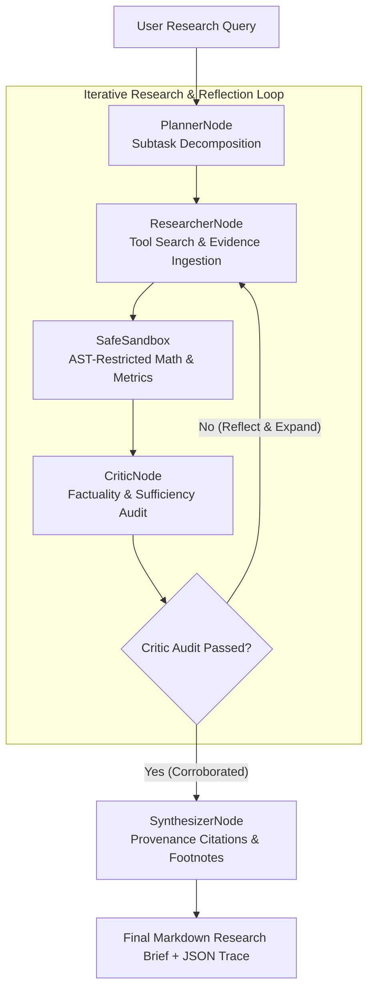

# Agentic Research System 🤖🔬

<p align="center">
  
  
  
  
  
  
</p>

An autonomous research and fact-checking engine built around a **deterministic directed state graph**. 

Rather than relying on fragile linear prompt chains, the system orchestrates iterative exploration: deconstructing queries into atomic sub-questions, dispatching multi-source tool queries, running sandboxed computations, and executing self-critique loops that detect missing evidence before compiling verified, citation-grounded research briefs.

---

## 🏛️ State Graph Architecture



---

## ⚡ Key Architectural Features

### 1. Deterministic State Graph & Cycle Budgeting
- Explicit transitions across structured lifecycle states: `PLANNING` → `RESEARCHING` → `COMPUTING` → `REFLECTING` → `SYNTHESIZING` → `COMPLETED`.
- Guardrails against infinite looping via configurable `max_cycles` and state checkpoints.

### 2. Critic & Self-Reflection Gate
- Evaluates evidence count, corroboration confidence, and factual coverage.
- Formulates targeted follow-up subtasks dynamically if evidence is missing or ambiguous.

### 3. Sandboxed Computation Engine
- AST-verified Python execution environment (`SafeSandbox`) that isolates mathematical and quantitative computations from arbitrary code execution risks.

### 4. Full Execution Observability
- Emits structured JSON execution traces capturing node latencies, token consumption, state diffs, and transition metadata.

---

## 🚀 Quick Start

### 1. Installation

```bash
git clone https://github.com/amwanshul/agentic-research-system.git
cd agentic-research-system

python -m venv venv
# Windows:
.\venv\Scripts\activate
# Linux/macOS:
source venv/bin/activate

pip install -r requirements.txt
pip install -e .
```

### 2. Run an Autonomous Research Task

```bash
python -m agentic_research.cli "Direct Preference Optimization benchmarks" --trace-out run_trace.json
```

---

## 🧪 Testing & Verification

Run the test suite covering state transitions, sandbox isolation, and reflection logic:

```bash
PYTHONPATH=. pytest tests/ -v
```

All 6 unit tests execute deterministically in < 0.1s without external API dependencies.

---

## 📜 License

Distributed under the [MIT License](LICENSE).
